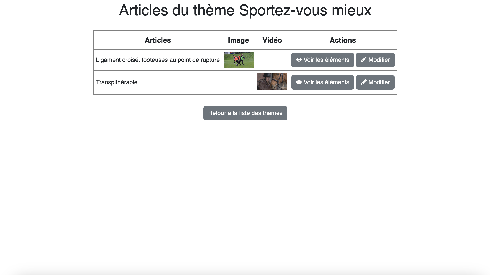
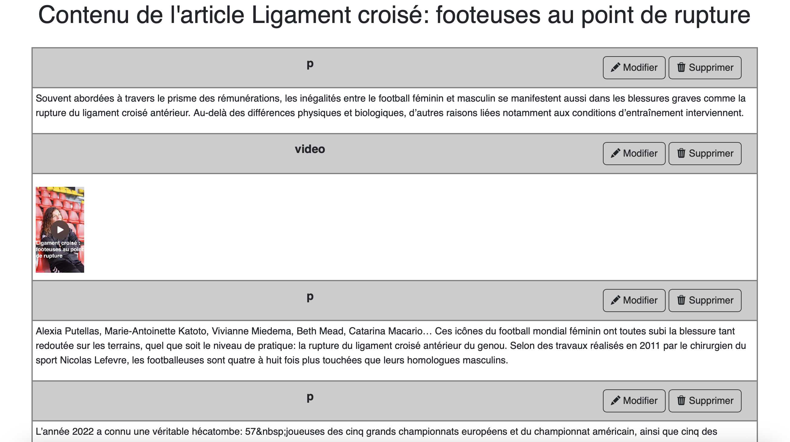
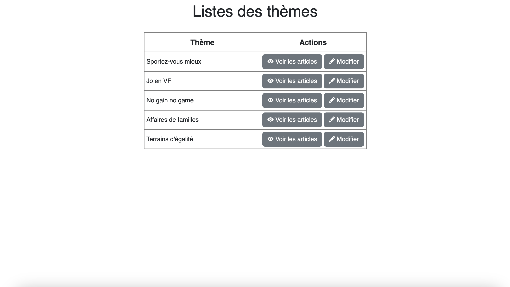
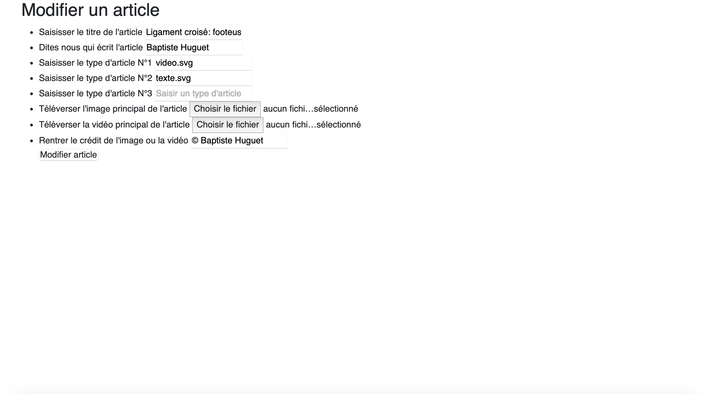

# CUEJ SportManiac

Ce projet est une plateforme web développée pour la gestion et la présentation de contenus sportifs, utilisant PHP côté serveur et Bootstrap 5 côté frontend.

## Installation

### Prérequis

- PHP >= 7.4
- Serveur web (Apache, Nginx…)
- Composer (pour la gestion des dépendances PHP)
- Node.js & npm (pour la gestion des dépendances front-end, si applicable)

### Installation des dépendances

1. **Cloner le dépôt :**
   ```bash
   git clone https://github.com/laurabni/cuej_sportmaniac.git
   cd cuej_sportmaniac
   ```

2. **Installer les dépendances PHP :**
   ```bash
   composer install
   ```

3. **Installer les dépendances front-end (si applicable) :**
   ```bash
   npm install
   ```

4. **Configurer le fichier `.env` ou les paramètres de connexion à la base de données selon votre environnement.**

5. **Lancer le serveur local (exemple avec PHP) :**
   ```bash
   php -S localhost:8000
   ```

## Accès au site

Le projet est consultable en ligne à l’adresse suivante :  
👉 [http://www.cuej.info/mini-sites/sport/](http://www.cuej.info/mini-sites/sport/)

## Captures d’écran du back-office

Voici quelques aperçus de l’interface du back-office :

**Liste des articles**  


**Gestion des éléments**  


**Gestion des thèmes**  


**Formulaire de création/modification d’article**  


## Fonctionnalités principales

- Gestion de contenus sportifs (articles, images, vidéos)
- Interface d'administration
- Design responsive avec Bootstrap 5
- Upload de fichiers (images, vidéos, audio)